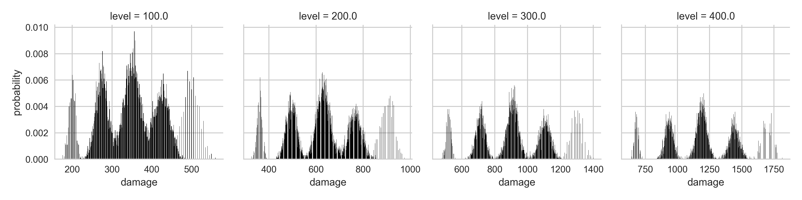

# `soda-rz`



Program to calculate and plot the probability distribution for
the total damage output (on the first round) of a [Soda Dungeon](http://sodadungeon.com)
party of 5 with 1 (or more) Ragezerker(s), taking into account the
stacked attack and probability to get critical hits, as the party
progresses through a given number of levels.

## Installation:

```
$ git clone git@github.com:eugene-eeo/soda-rz.git
$ cd soda-rz
$ make install
```

## Usage:

```
$ pipenv shell
$ ./run.sh graph.png --dpi=300
```

The party size, stats of party members (base damage, critical %,
base damage multiplier, and critical multiplier), etc. can be easily
configured by editing the `config.json` file. A sample configuration
is provided.

### Configuration options

 - `party` – array of stats of as many non-ragezerker party members
 as you want. For instance if one of members has 50% crit chance,
 120 damage (when it goes to fight, i.e. before any ragezerkerbuffs),
 15% boost to Phys attacks, and 245% crit damage:

 ```json
 {"atk": 120, "p_crit": 0.5, "m_crit": 2.45, "m_base": 1.15}
 ```

 - `samples` – how many parties to simulate. The higher the number
 the more useful the results.
 - `levels` – how many levels to simulate.
 - `report_every` – gather damage statistics at every multiple
 of the given level, e.g. if the `levels` option is set to 500 and
 `report_every` is 50, you will get damage statistics for level 50,
 100, 150, etc.
 - `workers` – the number of workers to use to run the simulation.
 The recommended number is the number of cores - 1.
